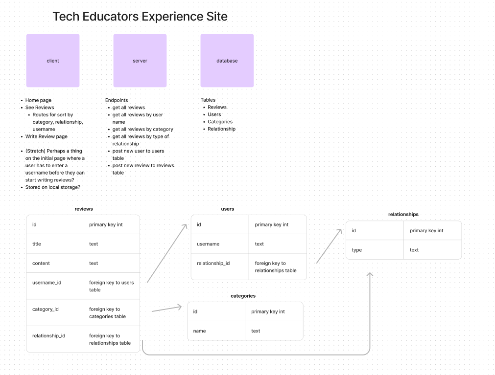

# Week Seven Project

## Project - Build a database driven React app

**Link to project:** [Vercel link](https://tech-ed-reviews.vercel.app/)


This week we extended our React knowledge, and brought back databases with Postgres.
The task was to build a full-stack app, where a dynamic webpage could interact with data stored elsewhere.

I kept track of my ideas, planning and progress here: [Planning](https://frankjs.notion.site/Day-Thirty-Two-Project-Full-Stack-Guestbook-e4e5d64b56a64e5aad337c179d55822c?pvs=4)

### Requirements & Deliverables

- Have a Database, a Server and a Client.
- Design databse schema.
- Seed the database with data.
- Create Express endpoints.
- Create multiple pages with React Router.

**Stretch Goals**

- Allow users to 'like' a post.
- Allow users to 'delete' a post.
- Allow users to filter posts by category.

### User Stories

- As a user, I want to be able to create new posts and add them to the page
- As a user, I want to be able to assign a category to each post
- As a user, I want to be able to view all posts added on the page and the category they're in
- As a user, I want to be able to view all posts in a specific category by visiting a dedicated page for that category (Stretch Goal)
- As a user, I want to be able to add new categories (Stretch Goal)

## The Outcome!

### Features!

- Database hosted on Supabase.
- Server built with Express and Postgres, hosted on Render.
- Client built with React.
- Styling ripped straight from the [Tech Educators website](https://techeducators.co.uk/).
- A form for the user to add reviews to the database.
- Sortable reviews.
- Searchable reviews.
- Reacts `useContext` implemented.

### What went well

**Planning**

- I used a combination of Figma and DrawSQL to get a visual on how the app would work, the functionality I wanted, and the layout of my database including the relationships between them

**Figma**

**DrawSQL**


- I worked on Supabase as a first step, to get my SQL statements correct; setting up my tables, inserting seed data, and creating select statements.

**Functionality**

As usual it was important to me to get a functional version of the website first before properly styling it. Small bits of CSS were useful to be able to better see parts of the pages, IE spacing out the reviews and the form.

Once I had the data from the database displaying on screen successfully, I moved on to implementing the form.

I found out that to POST a new review to the database, I first had to run an IF statement which checked if the username existed on the users table. If it did, it selected that user ID and if not, it created a new entry. The server would then move on to appending the new review to the database.

I like the simplicity of the form, and was satisfied with how it uses the data it's given, in particular

- Displaying drop-downs for categories and relationships
- Using ID's to match things up once in the database.

I enjoyed how the "Submitting..." and "Success!" screens work after a form submission.

**User Interface and Design**

While comfortable with flexbox, I haven't used grid too much in my projects so far. I decided now was the time, and utilised it for the inner display of each individual review.

Using the Tech Educators website as an existing theme really reduced the time it took for the website to have a style, which meant I could focus on the more important things.

### Sticky points and Difficulties

**Form submission**

Because I was using information from different tables in my form, I had to slow down and think about what data I needed and its flow after submission. Getting the correct IF statements took a little time but worked great once implemented.

**Grid grid grid**

As I haven't worked with grid as much as flexbox, I took more time figuring out which properties I needed to lay things out as I wanted them. Trial and error was the key here, as normal!

The more useful properties that unlocked what I wanted were:

- `grid-row`
- `grid-column`, with `span`
- `grid-auto-columns` with `minmax()`

**The simplest solution is often the best**

I pulled myself out of a rabbit hole early on, when I started to use SVG downloaders to grab the header icon and logo from the TechEd website.

I refocused on what was important, and quite simply used a png image of the whole thing instead, allowing me more time for the functionality and style of the rest of the website.

SVGs can wait!

On top of that, I copied Tech Educators styling so that I could focus my attention and learning on the functioning of the website, as opposed to rabbit hole-ing CSS and styles.

**I get by with a little help from my friends**

Over the weekend, some group troubleshooting with Precious and Darren really helped me get to a working solution to sort the Reviews by Category. (Thanks guys!)

Once I had that part working, I was able to modify the server-side code with some 'if' statements, which changed the appended "WHERE" clause depending on the type of parameter selected.

This allowed me to sort by Category, Relationship, or User.

I got the User sort working with a search box, and a 'wild card' search on the server side.

**Context**

I spent many hours implementing useContext.

I almost don't want to talk about it.....

One of the easier parts was lifting the definitions of `useState` out of the ReviewsPage components and into a separate Context file. I could wrap my head around that, and also the importing of the 'contexts' I needed.

I _really_ had a big wrestling match with trying to get the right variables and states to update at the correct times. **Lots** of console.logs to expose the flow of data, and trial & error fixes were needed to get something that works fairly well.

**Give me a trim!**

One of the last small things I needed to fix, after implementing useContext, was a behaviour on the "user search" page where _all_ of the Reviews were returned if the search box was empty.

I prompted [Cheryl Gene Patsy Thompson](https://chatgpt.com/) asking if there was a way to avoid returning all the reviews on an empty search box.

It directed me to the `.trim()` method, and advised to use it with an IF statement before the main code ran, resulting in this compact snippet:

```javascript
if (!user.trim()) {
  response.json([]);
  return;
}
```

Armed with my new trimming knowledge, I used the method further on in the code block to tidy up user search queries:

`const result = await db.query(sqlQuery, [`%${user.trim()}%`]);`

### Future improvements

- Implementing some kind of 'user login' or authentication would be nice, so that the system of attaching user names to a review can be monitored (otherwise, we could all pretend to be the CEO!).

- I'm still not fully comfortable with useContext! I'm sure there's a nicer way to achieve what I set out to do, with resetting the "Sort By" dynamic route pages.

- Styling tweaks, especially for the display of reviews.

### Resources

Figma - [My Figma](https://www.figma.com/file/bV6ZzcJXjXRlSJWiVmF3t0/Week-07-Project-Planning?type=whiteboard&node-id=2%3A84&t=J2XrAqaawgMOeb9j-1)

DrawSQL - [My DrawSQL](https://drawsql.app/teams/personal-1367/diagrams/07-week-seven-project)

React Router Docs for NavLinks - [React Router](https://reactrouter.com/en/main/components/nav-link)

Tech Educators website for design ~~theft~~ inspiration - [TechEd](https://techeducators.co.uk/)

Space Grotesk Google Font - [Font page](https://fonts.google.com/specimen/Space+Grotesk)

Javascript `.trim()` methiod - [W3 Schools](https://www.w3schools.com/jsref/jsref_trim_string.asp)
