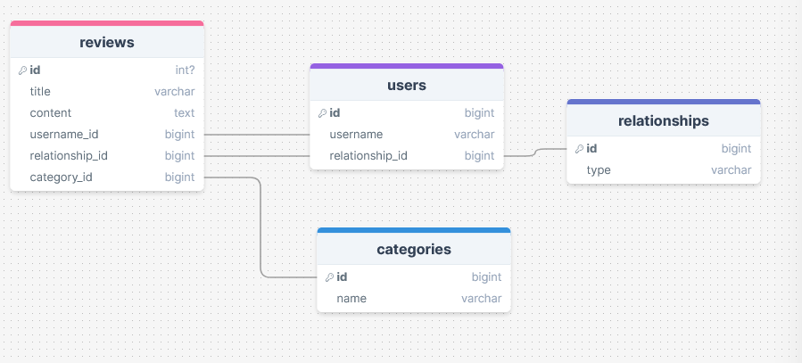

# Week Seven Project

## Project - Build a database driven React app

**Link to project:**

This week we extended our React knowledge, and brought back databases with Postgres.
The task was to build a full-stack app, where a dynamic webpage could interact with data stored elsewhere.

I kept track of my ideas, planning and progress here: [Planning](https://frankjs.notion.site/Day-Thirty-Two-Project-Full-Stack-Guestbook-e4e5d64b56a64e5aad337c179d55822c?pvs=4)

### Requirements & Deliverables

- Have a Database, a Server and a Client.
- Design databse schema.
- Seed the database with data.
- Create Express endpoints.
- Create multiple pages with React Router.

**Stretch Goals**

- Allow users to 'like' a post.
- Allow users to 'delete' a post.
- Allow users to filter posts by category.

### User Stories

- As a user, I want to be able to create new posts and add them to the page
- As a user, I want to be able to assign a category to each post
- As a user, I want to be able to view all posts added on the page and the category they're in
- As a user, I want to be able to view all posts in a specific category by visiting a dedicated page for that category (Stretch Goal)
- As a user, I want to be able to add new categories (Stretch Goal)

## The Outcome!

### Features!

-

### What went well

**Planning**

- I used a combination of Figma and DrawSQL to get a visual on how the app would work, the functionality I wanted, and the layout of my database including the relationships between them

- I worked on Supabase as a first step, to get my SQL statements correct; setting up my tables, inserting seed data, and creating select statements.

**Functionality**

- **User Interface and Design**

### Sticky points and Difficulties

**One**

**Two**

**Three**

### Future improvements

-

### Resources

Figma - [My Figma](https://www.figma.com/file/bV6ZzcJXjXRlSJWiVmF3t0/Week-07-Project-Planning?type=whiteboard&node-id=2%3A84&t=J2XrAqaawgMOeb9j-1)
DrawSQL - [My DrawSQL](https://drawsql.app/teams/personal-1367/diagrams/07-week-seven-project)
